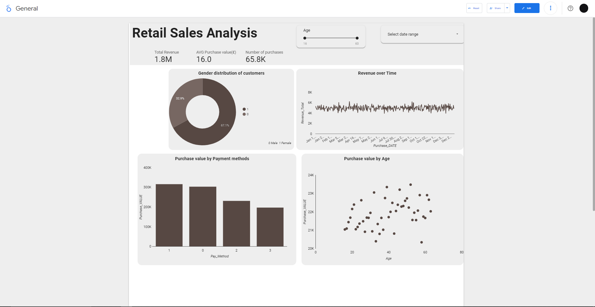
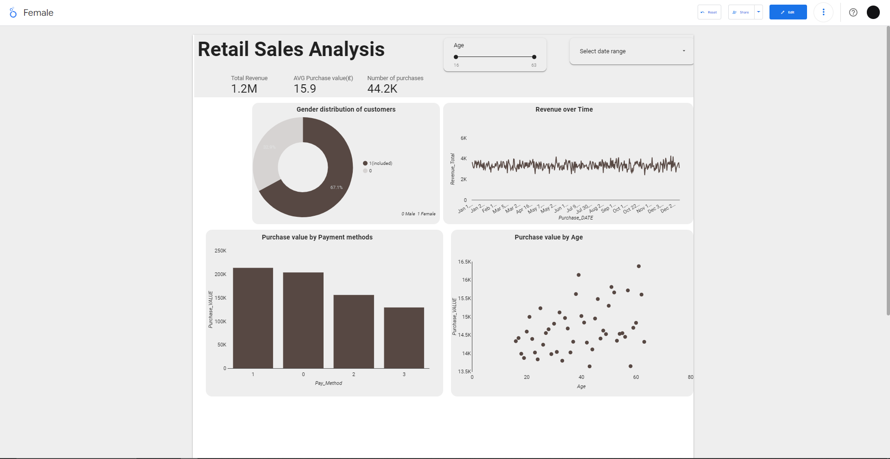
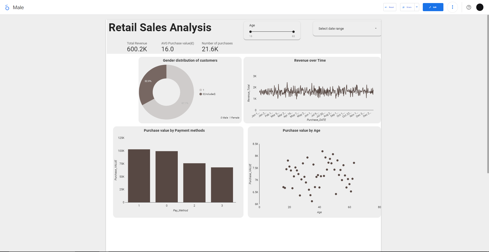

# Retail-Sales-Analysis

## Table of contents
- [Dataset Description](#Dataset-description)
- [Steps:](#Steps)
  - [Data Exploration](#Data-Exploration)
  - [Dashboard Design](#Dashboard-Design)
    - [Dashboard Components](#Dashboard-Components)
    - [Interactivity](#Interactivity)
  - [Dashboard Presentation](#Dashboard-Presentation)

## Dataset Description
- The dataset contains information about online retail sales transactions. It includes the following columns:
   -  Customer_id: Unique customer ID
   -  Age: Customer's age
   -  Gender: 0 for Male, 1 for Female
   -  Revenue_Total: Total sales by customer
   -  N_Purchases: Number of purchases to date
   -  Purchase_DATE: Date of the latest purchase (in mm/dd/yy format)
   -  Purchase_VALUE: Latest purchase amount in €
   -  Pay_Method: Payment method (0 for Digital Wallets, 1 for Card, 2 for PayPal, 3 for Other)
   -  Time_Spent: Time spent on the website (in seconds)
   -  Browser: Type of browser used (0 for Chrome, 1 for Safari, 2 for Edge, 3 for Other)
   -  Newsletter: Subscription status for newsletter (0 for not subscribed, 1 for subscribed)
   -  Voucher: Voucher usage status (0 for not used, 1 for used)

Get the dataset I used [Online Shop Customer Sales Data](assets/dataset/Copy of Demo - livelystep - lilvelystep - data.csv)

## Steps:
- The main task is to create an interactive dashboard using *Looker* to visualize key insights from the provided dataset by following the steps below.
### Data Exploration
 -  I began by exploring the dataset to understand its structure and contents.
 -  Identified potential data quality issues that needed to be addressed and fixed.
### Dashboard Design
 -  Designed a dashboard layout that highlights key metrics and trends related to online retail sales transactions.
#### Dashboard Components
- Included the following visualization components in my dashboard:
  -  A *line chart* showing trends in revenue over time.
  -  A *bar chart* comparing the distribution of purchase values across different payment methods.
  -  A *pie chart* illustrating the gender distribution of customers.
  -  A *scatter plot* showing the relationship between age and purchase value.
  -  A *KPI scorecard* summarizing key performance indicators such as total revenue, average purchase value, and number of purchases.
#### Interactivity
 -  Implemented interactive features such as *slider* and *date range control* to allow users to explore the data dynamically.
### Dashboard Presentation
-  Ensured that my dashboard is visually appealing, easy to navigate, and effectively communicates key insights from the dataset.

### Based on all customers

### Based on customers who are female

### Based on customers who are male

